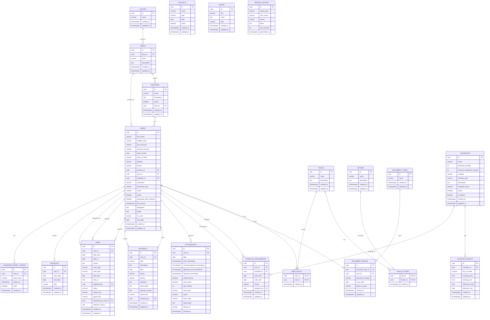

# Dusakawi EPSI — Database Schema (ERD)

## Relaciones principales

| Tabla | FK | Referencia |
|---|---|---|
| `areas` | `floor_id` | `floors.id` |
| `positions` | `area_id` | `areas.id` (nullable) |
| `users` | `position_id` | `positions.id` |
| `users` | `area_id` | `areas.id` |
| `users` | `schedule_id` | `schedules.id` (cache vía trigger) |
| `role_actions` | `role_id` / `action_id` | `roles.id` / `actions.id` |
| `user_roles` | `user_id` / `role_id` | `users.id` / `roles.id` |
| `document_details` | `document_type_id` / `user_id` | `document_types.id` / `users.id` |
| `schedule_details` | `schedule_id` | `schedules.id` |
| `schedule_assignments` | `user_id` / `schedule_id` / `assigned_by` | `users.id` / `schedules.id` / `users.id` |
| `attendances` | `user_id` | `users.id` |
| `incidents` | `user_id` / `reviewed_by` | `users.id` / `users.id` |
| `news` | `user_id` / `registered_by` / `requested_by_user_id` | `users.id` × 3 |
| `requests` | `user_id` | `users.id` |
| `password_reset_tokens` | `user_id` | `users.id` |

## Triggers

| Trigger | Tabla | Función |
|---|---|---|
| `trg_*_updated_at` | Todas con `updated_at` | Actualiza `updated_at` en cada UPDATE |
| `trg_sync_user_schedule_cache` | `schedule_assignments` | Sincroniza `users.schedule_id` con la asignación vigente |