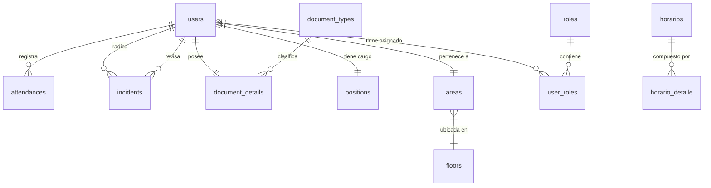

# Data Model: Esquema Unificado de Base de Datos (PostgreSQL)

**Feature**: `001-frankenstein-functional-integration`
**Date**: 2026-09-22
**Database**: PostgreSQL 17 (Docker: `dusakawi-postgres`)

---

## 1. Núcleo de Identidad y Estructura Organizacional

### `users` (Usuarios y Empleados Unificados)
Representa a todo colaborador y usuario del sistema en una única tabla centralizada.
- `id` (UUID, PK, Default: `gen_random_uuid()`)
- `first_name` (VARCHAR(100), NOT NULL)
- `middle_name` (VARCHAR(100), NULL)
- `first_surname` (VARCHAR(100), NOT NULL)
- `second_surname` (VARCHAR(100), NULL)
- `date_of_birth` (DATE, NOT NULL)
- `place_of_birth` (VARCHAR(150), NOT NULL)
- `address` (VARCHAR(255), NOT NULL)
- `phone` (VARCHAR(20), NULL)
- `cell` (VARCHAR(20), NOT NULL)
- `position_id` (UUID, NOT NULL, FK → `positions.id`)
- `area_id` (UUID, NOT NULL, FK → `areas.id`)
- `username` (VARCHAR(50), NOT NULL, UNIQUE)
- `password_hash` (VARCHAR(255), NOT NULL)
- `email` (VARCHAR(150), NOT NULL, UNIQUE)
- `created_at` (TIMESTAMPTZ, NOT NULL, Default: `now()`)
- `updated_at` (TIMESTAMPTZ, NULL, Trigger: `set_updated_at()`)

### `document_types` (Tipos de Documento de Identidad)
- `id` (UUID, PK, Default: `gen_random_uuid()`)
- `name` (VARCHAR(100), NOT NULL, UNIQUE) - Ej: 'Cédula de Ciudadanía', 'Cédula de Extranjería', 'Pasaporte'
- `created_at` (TIMESTAMPTZ, NOT NULL, Default: `now()`)
- `updated_at` (TIMESTAMPTZ, NULL)

### `document_details` (Detalles de Identificación del Usuario)
- `id` (UUID, PK, Default: `gen_random_uuid()`)
- `document_type_id` (UUID, NOT NULL, FK → `document_types.id`)
- `user_id` (UUID, NOT NULL, UNIQUE, FK → `users.id` ON DELETE CASCADE)
- `document_number` (VARCHAR(50), NOT NULL, UNIQUE)
- `issue_date` (DATE, NOT NULL)
- `place_of_issue` (VARCHAR(150), NOT NULL)
- `created_at` (TIMESTAMPTZ, NOT NULL, Default: `now()`)
- `updated_at` (TIMESTAMPTZ, NULL)

### `roles` (Roles de Seguridad)
- `id` (UUID, PK, Default: `gen_random_uuid()`)
- `name` (VARCHAR(100), NOT NULL, UNIQUE) - 'Administrador', 'Talento Humano', 'Empleado'
- `description` (TEXT, NOT NULL)
- `created_at` (TIMESTAMPTZ, NOT NULL, Default: `now()`)
- `updated_at` (TIMESTAMPTZ, NULL)

### `user_roles` (Asignación de Roles a Usuarios)
- `user_id` (UUID, NOT NULL, FK → `users.id` ON DELETE CASCADE)
- `role_id` (UUID, NOT NULL, FK → `roles.id` ON DELETE CASCADE)
- `created_at` (TIMESTAMPTZ, NOT NULL, Default: `now()`)
- PK (`user_id`, `role_id`)

### `positions` (Cargos Institucionales)
- `id` (UUID, PK, Default: `gen_random_uuid()`)
- `name` (VARCHAR(100), NOT NULL, UNIQUE)
- `description` (TEXT, NOT NULL)
- `created_at` (TIMESTAMPTZ, NOT NULL, Default: `now()`)
- `updated_at` (TIMESTAMPTZ, NULL)

### `floors` (Pisos del Edificio Institucional)
- `id` (UUID, PK, Default: `gen_random_uuid()`)
- `name` (VARCHAR(100), NOT NULL, UNIQUE) - Ej: 'Piso 1', 'Piso 2', 'Sótano'
- `created_at` (TIMESTAMPTZ, NOT NULL, Default: `now()`)
- `updated_at` (TIMESTAMPTZ, NULL)

### `areas` (Áreas y Departamentos de Trabajo)
- `id` (UUID, PK, Default: `gen_random_uuid()`)
- `floor_id` (UUID, NOT NULL, FK → `floors.id`)
- `name` (VARCHAR(100), NOT NULL)
- `description` (TEXT, NULL)
- `created_at` (TIMESTAMPTZ, NOT NULL, Default: `now()`)
- `updated_at` (TIMESTAMPTZ, NULL)
- UNIQUE (`name`, `floor_id`)

---

## 2. Registro de Asistencias e Incidencias

### `attendances` (Marcaciones Diarias de Asistencia)
- `id` (UUID, PK, Default: `gen_random_uuid()`)
- `user_id` (UUID, NOT NULL, FK → `users.id`)
- `first_entry_time` (TIME, NULL) - Entrada mañana
- `first_departure_time` (TIME, NULL) - Salida mañana (almuerzo)
- `last_entry_time` (TIME, NULL) - Entrada tarde (regreso)
- `last_departure_time` (TIME, NULL) - Salida tarde (cierre de jornada)
- `created_at` (TIMESTAMPTZ, NOT NULL, Default: `now()`) - Contiene la fecha del día de registro

### `incidents` (Incidencias y Justificaciones)
- `id` (UUID, PK, Default: `gen_random_uuid()`)
- `user_id` (UUID, NOT NULL, FK → `users.id`)
- `type` (VARCHAR(50), NOT NULL) - 'Tardanza', 'Inasistencia', 'Permiso', 'Cita Médica'
- `description` (TEXT, NOT NULL)
- `status` (VARCHAR(50), NOT NULL, Default: 'Pendiente') - 'Pendiente', 'Aprobada', 'Rechazada'
- `priority` (VARCHAR(20), NOT NULL, Default: 'Media') - 'Baja', 'Media', 'Alta'
- `evidence` (TEXT, NULL) - URL o ruta del adjunto digital
- `observation` (TEXT, NULL) - Notas del revisor
- `rejection_reason` (TEXT, NULL) - Motivo en caso de rechazo
- `signed_file` (VARCHAR(255), NULL) - Documento firmado si aplica
- `reviewed_by` (UUID, NULL, FK → `users.id`)
- `created_at` (TIMESTAMPTZ, NOT NULL, Default: `now()`)
- `updated_at` (TIMESTAMPTZ, NULL)

### `holidays` (Días Festivos y No Laborales)
- `id` (UUID, PK, Default: `gen_random_uuid()`)
- `name` (VARCHAR(150), NOT NULL)
- `type` (VARCHAR(50), NOT NULL) - 'Nacional', 'Institucional'
- `date` (DATE, NOT NULL)
- `active` (BOOLEAN, NOT NULL, Default: `true`)
- `created_at` (TIMESTAMPTZ, NOT NULL, Default: `now()`)
- `updated_at` (TIMESTAMPTZ, NULL)

---

## 3. Tablas Complementarias (Horarios y Parámetros)

### `horarios` (Horario Maestro)
- `id` (SERIAL / UUID, PK)
- `nombre` (VARCHAR(100), NOT NULL)
- `tolerancia_minutos` (INTEGER, Default: 15)
- `creado_en` (TIMESTAMPTZ, Default: `now()`)

### `horario_detalle` (Turnos por Día de la Semana)
- `id` (SERIAL / UUID, PK)
- `horario_id` (FK → `horarios.id` ON DELETE CASCADE)
- `dia_semana` (VARCHAR(20), NOT NULL) - 'Lunes', 'Martes', 'Miércoles', 'Jueves', 'Viernes', 'Sábado', 'Domingo'
- `hora_entrada_manana` (TIME, NULL)
- `hora_salida_manana` (TIME, NULL)
- `hora_entrada_tarde` (TIME, NULL)
- `hora_salida_tarde` (TIME, NULL)

### `configuracion` (Parámetros Generales del Sistema)
- `id` (SERIAL / UUID, PK)
- `clave` (VARCHAR(100), NOT NULL, UNIQUE)
- `valor` (TEXT, NOT NULL)
- `tipo` (VARCHAR(20), Default: 'text') - 'text', 'number', 'boolean'
- `actualizado_en` (TIMESTAMPTZ, Default: `now()`)

---

## 4. Diagrama Relacional de Entidades

