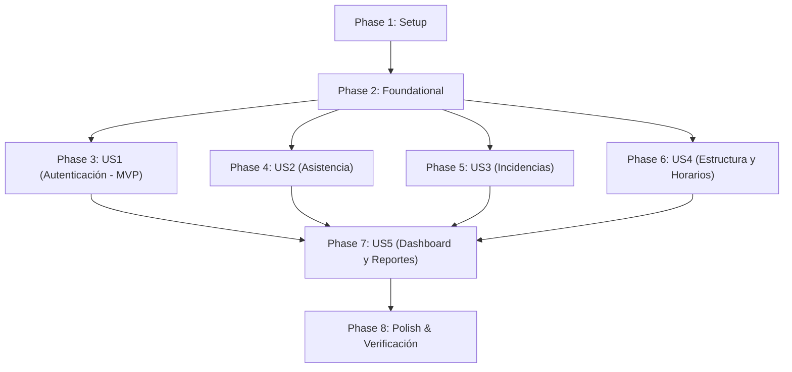

# Tasks: Integración Funcional del Sistema de Asistencia (Frankenstein Funcional)

**Input**: Design documents from `specs/001-frankenstein-functional-integration/`
**Prerequisites**: `plan.md`, `spec.md`, `research.md`, `data-model.md`, `contracts/`, `quickstart.md`
**Constitution Governance**: Strict compliance with Constitution v2.0 (Zero tests, TS priority for auth/users/areas, JS SQL adaptation, hybrid Node.js execution, frontend UI preservation).

## Format: `[ID] [P?] [Story] Description`
- **[P]**: Ejecutable en paralelo (archivos independientes, sin bloqueo directo)
- **[Story]**: Historia de usuario correspondiente ([US1], [US2], [US3], [US4], [US5])
- Rutas de archivo exactas en cada tarea

---

## Phase 1: Setup (Infraestructura Compartida y Base de Datos)

**Propósito**: Preparación de esquemas de base de datos y configuración del entorno

- [X] T001 Crear script de tablas complementarias `backend/src/config/database/complementary_tables.sql` con las tablas `horarios`, `horario_detalle` y `configuracion` con datos semilla iniciales
- [X] T002 Ejecutar script de tablas complementarias en el contenedor PostgreSQL de Docker `dusakawi-postgres`
- [X] T003 [P] Configurar variables de entorno en `backend/.env` para conectar al PostgreSQL local y definir `JWT_SECRET` institucional

---

## Phase 2: Foundational (Infraestructura Bloqueante y Coexistencia Híbrida)

**Propósito**: Infraestructura central que DEBE estar completa antes de montar las historias de usuario

- [X] T004 Ajustar el wrapper de conexión en `backend/src/config/db.js` para asegurar compatibilidad de consultas SQL con el pool de PostgreSQL
- [X] T005 [P] Unificar el middleware de autenticación `backend/src/middlewares/authMiddleware.js` para validar el JWT refactorizado y poblar `req.user`
- [X] T006 [P] Configurar el cargador híbrido en `backend/src/main.ts` utilizando `createRequire` para importar y registrar routers CommonJS
- [X] T007 [P] Configurar el cliente API base en `frontend/src/shared/api/api.js` y `frontend/src/api/api.js` para unificar la URL base `/api`

**Checkpoint**: Base de datos lista y servidor híbrido preparado para recibir controladores y vistas.

---

## Phase 3: User Story 1 - Autenticación y Acceso Seguro de Empleados y Administradores (Priority: P1) 🎯 MVP

**Meta**: Permitir inicio de sesión con retorno de token y contexto de usuario, cambio de contraseña y navegación según rol.
**Prueba Independiente**: Iniciar sesión desde `LoginPage.jsx` con credenciales de usuario registrado y verificar redirección al dashboard y almacenamiento de sesión en `localStorage`.

- [X] T008 [US1] Enriquecer el DTO de respuesta y handler en `backend/src/modules/auth/application/use-cases/login/login-query.handler.ts` para devolver `{ token, user }`
- [X] T009 [P] [US1] Implementar endpoint para cambio de contraseña en `backend/src/controllers/authController.js` y registrar en `backend/src/routes/authRoutes.js`
- [X] T010 [US1] Montar las rutas completas de autenticación en `backend/src/main.ts` bajo `/api/auth`
- [X] T011 [US1] Ajustar la llamada de inicio de sesión y guardado de sesión en `frontend/src/features/login/pages/LoginPage.jsx`
- [X] T012 [P] [US1] Actualizar el servicio de autenticación y cambio de clave en `frontend/src/api/authService.api.js` y `frontend/src/features/cambiarPassword/pages/CambiarPasswordPage.jsx`

**Checkpoint**: MVP de autenticación y control de acceso 100% operativo.

---

## Phase 4: User Story 2 - Registro y Control Diario de Asistencia (Priority: P1)

**Meta**: Registro de marcaciones de entrada y salida laboral matutina y vespertina, historial en "Mi Asistencia" y marcaciones manuales.
**Prueba Independiente**: Realizar una marcación desde "Mi Asistencia", verificar inserción en `attendances` y visualización inmediata en tabla mensual.

- [X] T013 [US2] Adaptar consultas SQL en `backend/src/controllers/asistenciaController.js` para operar sobre la tabla `attendances` con deducción de casillas (`first_entry_time`, `first_departure_time`, `last_entry_time`, `last_departure_time`)
- [X] T014 [P] [US2] Ajustar el router `backend/src/routes/asistenciaRoutes.js` y montarlo en `backend/src/main.ts` bajo `/api/asistencia`
- [X] T015 [US2] Actualizar el cliente API de asistencia en `frontend/src/features/asistencia/asistencia.api.js`
- [X] T016 [P] [US2] Sincronizar el consumo del historial en `frontend/src/features/miAsistencia/pages/MiAsistenciaPage.jsx`

**Checkpoint**: Flujo de marcaciones e historial personal plenamente funcional.

---

## Phase 5: User Story 3 - Gestión de Novedades, Incidencias y Justificaciones (Priority: P2)

**Meta**: Radicación de incidencias con archivo adjunto, bandeja de revisión para supervisores y aprobación o rechazo.
**Prueba Independiente**: Radicar una incidencia con adjunto desde cuenta de empleado y aprobarla desde cuenta de administrador.

- [X] T017 [US3] Adaptar consultas SQL en `backend/src/services/incidenciaService.js` para consultar y persistir sobre la tabla `incidents` en PostgreSQL
- [X] T018 [US3] Ajustar el controlador de incidencias en `backend/src/controllers/incidenciaController.js` para gestión de estados (Pendiente, Aprobada, Rechazada) y evidencias
- [X] T019 [P] [US3] Adaptar el controlador de novedades en `backend/src/controllers/novedadesController.js` y router `backend/src/routes/novedadesRoutes.js`
- [X] T020 [US3] Montar `incidenciaRoutes.js` y `novedadesRoutes.js` en `backend/src/main.ts` bajo `/api/incidencias` y `/api/novedades`
- [X] T021 [P] [US3] Actualizar el cliente API en `frontend/src/features/incidencias/incidencias.api.js` y `frontend/src/features/reportarIncidencia/reportarIncidencia.api.js`

**Checkpoint**: Ciclo completo de radicación y revisión de novedades e incidencias operativo.

---

## Phase 6: User Story 4 - Administración de Estructura Organizacional, Empleados y Horarios (Priority: P2)

**Meta**: Administración integral de funcionarios bajo `users`, cargos en `positions`, festivos en `holidays`, horarios por día y configuración general.
**Prueba Independiente**: Crear o editar un cargo, asignarlo a un empleado y ajustar la tolerancia en la pantalla de horarios verificando la persistencia en base de datos.

- [X] T022 [US4] Adaptar `backend/src/services/empleadoService.js` y `backend/src/controllers/empleadoController.js` para operar como vista/adaptador sobre la tabla `users` y `document_details`
- [X] T023 [P] [US4] Adaptar `backend/src/services/cargoService.js` y `backend/src/controllers/cargoController.js` para consultar y persistir en la tabla `positions`
- [X] T024 [P] [US4] Adaptar `backend/src/controllers/festivosController.js` para operar sobre la tabla `holidays`
- [X] T025 [P] [US4] Adaptar `backend/src/controllers/horarioController.js` para operar contra las tablas `horarios` y `horario_detalle`
- [X] T026 [P] [US4] Adaptar `backend/src/controllers/configController.js` para operar sobre la tabla `configuracion`
- [X] T027 [US4] Montar rutas en `backend/src/main.ts` (`/api/empleados`, `/api/cargos`, `/api/festivos`, `/api/horarios`, `/api/config`)
- [X] T028 [P] [US4] Sincronizar clientes API del frontend en `frontend/src/api/empleado.api.js`, `frontend/src/features/cargos/cargo.api.js`, `frontend/src/features/festivos/festivo.api.js` y `frontend/src/features/horarios/horario.api.js`

**Checkpoint**: Catálogos maestros, estructura institucional, personal y horarios 100% operativos.

---

## Phase 7: User Story 5 - Generación de Reportes, Exportación de Documentos y Dashboard Operativo (Priority: P3)

**Meta**: Dashboard con tarjetas cuantitativas de asistencia diaria, tablas dinámicas de reportes y descarga oficial de PDFs con membrete.
**Prueba Independiente**: Cargar el dashboard principal verificando conteos reales del día y descargar un reporte PDF de asistencia por área.

- [X] T029 [US5] Adaptar consultas SQL en `backend/src/controllers/dashboardController.js` para computar presentes, ausentes, retardos e incidencias sobre `attendances`, `users` e `incidents`
- [X] T030 [US5] Adaptar consultas tabulares en `backend/src/controllers/reportesController.js` para generar consolidados por período y área sobre `attendances` y `users`
- [X] T031 [P] [US5] Adaptar el generador de reportes PDF con membrete en `backend/src/routes/pdfRoutes.js` para emitir documentos con PDFKit desde `attendances` y `users`
- [X] T032 [US5] Montar las rutas en `backend/src/main.ts` bajo `/api/dashboard`, `/api/reportes` y `/api/pdf`
- [X] T033 [P] [US5] Actualizar clientes API en `frontend/src/features/dashboard/dashboard.api.js` y `frontend/src/features/reportes/reportes.api.js`

**Checkpoint**: Dashboard y reportería documental PDF totalmente funcionales.

---

## Phase 8: Polish & Cross-Cutting Concerns

**Propósito**: Ajustes de carpetas de almacenamiento y verificación funcional integral

- [X] T034 [P] Crear y asegurar permisos del directorio estático `backend/uploads/` y subdirectorios de evidencias
- [X] T035 Ejecutar la guía de validación funcional de extremo a extremo descrita en `specs/001-frankenstein-functional-integration/quickstart.md`

---

## Dependencies & Execution Order

### Phase Dependencies

### User Story Dependencies
- **User Story 1 (P1)**: Depende únicamente de Foundational (Phase 2). Es el MVP base.
- **User Story 2 (P1)**: Depende de Foundational (Phase 2). Utiliza el token de US1.
- **User Story 3 (P2)**: Depende de Foundational (Phase 2). Se enlaza al usuario de US1.
- **User Story 4 (P2)**: Depende de Foundational (Phase 2). Alimenta los catálogos para US1 y US2.
- **User Story 5 (P3)**: Depende de la presencia de datos de US1, US2 y US3 para mostrar métricas y reportes consolidados.

---

## Parallel Opportunities
- **Setup y Foundation**: T003, T005, T006, T007 pueden ejecutarse en paralelo por tocar archivos distintos.
- **User Story 1**: T009 y T012 pueden desarrollarse en paralelo con T008 y T011.
- **User Story 4**: T023 (cargos), T024 (festivos), T025 (horarios), T026 (config) y T028 (APIs de frontend) son paralelizables entre sí.
- **User Story 5**: T031 (PDFKit) y T033 (Frontend reportes) pueden avanzar en paralelo con T029 y T030.

---

## Implementation Strategy
1. **MVP Inmediato (US1)**: Completar Setup (Fase 1), Foundational (Fase 2) y US1 (Fase 3). Validar login, roles y sesión.
2. **Entrega de Asistencia e Incidencias (US2 + US3)**: Conectar marcación matutina/vespertina y gestión de justificaciones con soporte.
3. **Catálogos y Estructura (US4)**: Habilitar administración completa de funcionarios, cargos, festivos y horarios.
4. **Reportería y Cierre (US5 + Polish)**: Conectar dashboard y descargas PDF institucionales, ejecutando la verificación de `quickstart.md`.
